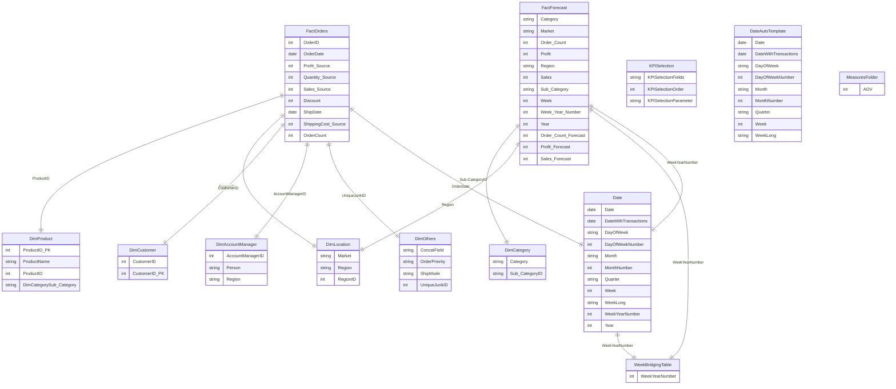

# :bar_chart: Superstore Revenue Semantic Model Documentation :notebook:

***

## :pushpin: 1.0 Overview

This Power BI semantic model is designed to provide sales, profitability, location, and customer data for analytical reporting. The schema follows a **star schema design**, ensuring optimal performance and usability for reporting needs.

The model is structured with **fact tables** containing transactional and forecast data & **dimension tables** providing contextual information for analysis.

This model's SPOC is Seyi Akinsanya who can be reached at akinsanyaseyi225@gmail.com for further inquiries. It is loacted in the Portfolio Projects Workspace.

This model is used in the following report(s):

[Superstore Weekly Revenue Report](https://app.powerbi.com/view?r=eyJrIjoiZTk0OWQwYzktODU3MC00MGE0LWIzM2UtMjI3ODVjMzlkNzZiIiwidCI6IjRiYWMzNjU3LTBhOGItNGM4Mi04YmY1LTU3MWZlMGVlZThmZSJ9&pageName=d0f7f61240debb412c3e)

***

## :pushpin: 2.0 Key Business Requirements & User Segments

### :triangular_flag_on_post: 2.1 Key Business Requirements

The model is designed to support the following requirements:

1. **Sales and Forecasting Analysis**
   - Track actual sales vs. forecasted sales.
   - Analyze sales performance by region, product, and category.

2. **Customer Insights**
   - Analyze customer purchasing behavior.
   - Segment customers based on sales patterns.

3. **Market and Location Analysis**
   - Performance analysis based on market, region and account manager.
   - Identify trends in different geographical areas.

4. **Product and Category Performance**
   - Evaluate product performance across different categories.
   - Compare sales trends over time.
     
5. **Operational Efficiency**
   - Compare order and ship dates across product categories and regions.
   - Track on time delivery by ship modes and order priorities.

### :triangular_flag_on_post: 2.2 User Segments

The model has the following user segments:

1. Commercial, Marketing and Operations Directors

2. Category managers and product owners.

3. Regional account managers.

### :triangular_flag_on_post: 2.3 Review ERD

The following is the **Entity-Relationship Diagram (ERD)** representing the Power BI semantic model.

Key highlights of the ERD:
- **FactOrders** and **FactForecast** contain the main transactional data.
- **DimProduct, DimCategory, DimAccountManager DimCustomer, DimOthers, DimLocation** provide contextual attributes.
- **Date table and Week Bridging Table** support time-based analysis.
- **Measures Folder & KPI Selection** enable dynamic metric selection.

***

## :pushpin: 3.0 Schema Breakdown

### :triangular_flag_on_post: 3.1 Fact Tables

#### **FactOrders**
- **Primary Key:** Order ID
- **Key Columns:** Sales (Source), Profit (Source) , Order Count
- **Metrics:** Sales, Quantity, Profit, Discount, Shipping Cost
- **Relationships:** Connected to **DimProduct, DimCustomer, DimLocation, DimAccountManager, DimOthers, Date**

#### **FactForecast**
- **Primary Key:** (Composite - Week Year Number, Sub-Category, Region)
- **Metrics:** Sales Forecast, Order Count Forecast, Profit Forecast
- **Relationships:** Connected to **Week Bridging Table, DimLocation, DimCategory**

### :triangular_flag_on_post: 3.2 Dimension Tables

#### **DimProduct**
- **Primary Key:** ProductID_PK
- **Attributes:** Product Name, Category, Sub-Category
- **Relationships:** Linked to **DimCategory** and **FactOrders**

#### **DimCategory**
- **Primary Key:** Sub-CategoryID
- **Attributes:** Category, Sub-Category
- **Relationships:** Linked to **DimProduct** and **FactForecast**

#### **DimCustomer**
- **Primary Key:** CustomerID_PK
- **Attributes:** Customer ID, Customer Name
- **Relationships:** Connected to **FactOrders**

#### **DimOthers**
- **Primary Key:** Unique JunkID
- **Attributes:** Order Priority, Ship Mode
- **Relationships:** Connected to **FactOrders**

#### **DimLocation**
- **Primary Key:** RegionID
- **Attributes:** Market, Region
- **Relationships:** Connected to **FactOrders, FactForecast**

#### **DimAccountManager**
- **Primary Key:** AccountManagerID
- **Attributes:** Person, Region
- **Relationships:** Connected to **FactOrders**

#### **Date Table**
- **Primary Key:** Date
- **Attributes:** Year, Month, Quarter, Week, Day
- **Relationships:** Connected to **FactOrders, FactForecast**

### :triangular_flag_on_post: 3.3 Supporting Tables

#### **Week Bridging Table**
- **Primary Key:** Week Year Number
- **Purpose:** Used for weekly time-based aggregations
- **Relationships:** Connected to **FactForecast**

#### **KPI Selection**
- **Attributes:** KPI Selection Fields, Order, Parameter
- **Purpose:** Enables dynamic metric selection in reports
- **Relationships:** Used for KPI slicer interactions

#### **Measures Folder**
- **Purpose:** Organizes calculated measures in display folders for improved usability
- **Common Measures:** Sales, AOV, Profit Margin

***

## :pushpin: 5.0 Performance Optimization & Security

### :triangular_flag_on_post: 5.1 Performance Optimization

1. **Star Schema Implementation**
   - Ensures **faster query performance** by reducing redundant relationships.
   - Fact tables contain **numeric metrics**, while dimension tables contain **descriptive attributes**.

2. **Aggregation Strategy**
   - Measures are **pre-aggregated** for better performance.
   - Week-based aggregations improve **trend analysis**.

3. **Optimized Data Relationships**
   - Avoided **many-to-many** relationships.
   - Used **a bridging table** for week-based analysis.

4. **Dynamic Filtering Using Parameters**
   - Implemented **KPI selection** to allow users to switch between different metrics dynamically.

5. **Junk Dimension**
   - Implemented to make model more performant by removing important but rarely used low cardinality dimensions from the fact table.

### :triangular_flag_on_post: 5.2 Security

1. Row level security applied to DimAccountManager using DAX (USERPRINCIPALNAME) to limit account managers to their respective regions.

***

## :pushpin: 6.0 Conclusion

This Power BI semantic model is structured for **optimal reporting performance** with a **well-defined star schema**. The model supports **sales analysis, forecasting, customer segmentation, and time-based trends**.

