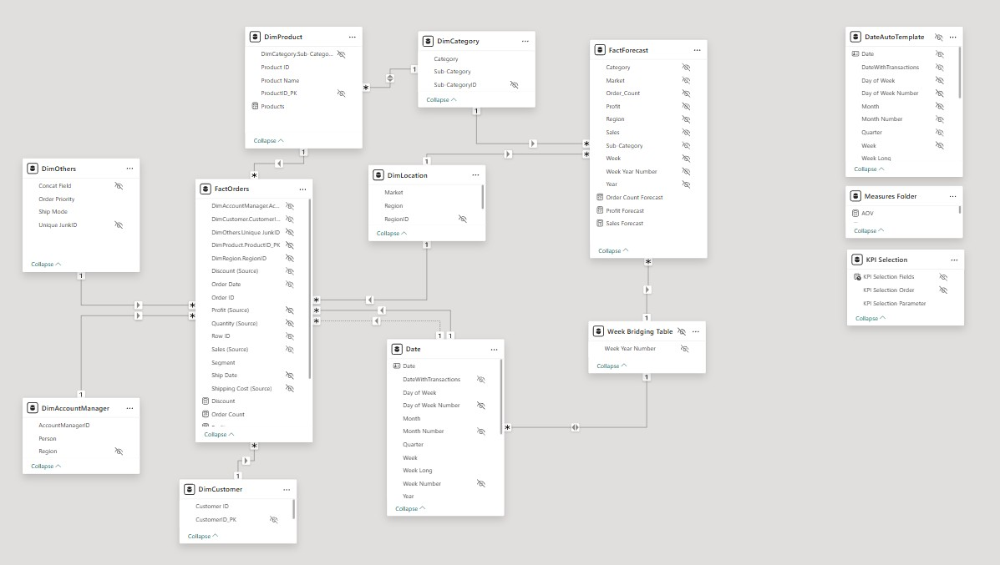

# :bar_chart: Power BI Semantic Model Documentation :notebook:

## :clipboard: Learning Outcomes :heavy_check_mark:

Click here to view learning outcomes from this documentation!

The following Power BI skills and concepts will be covered in this documentation:

1. **Understanding Entity-Relationship Diagrams (ERDs)**
   - Analyzing schema structure and table relationships.
   - Understanding cardinality and primary/foreign keys.
   - Using ERDs to map out data flows and dependencies.

2. **Data Modeling Best Practices**
   - Designing a star schema for optimized performance.
   - Using dimension and fact tables efficiently.
   - Avoiding unnecessary many-to-many relationships.

3. **Fact & Dimension Table Definitions**
   - Categorizing tables based on their roles.
   - Understanding granularity and aggregation levels.
   - Maintaining data integrity across relationships.

4. **Time Intelligence and Date Table Implementation**
   - Creating a date table for time-based analysis.
   - Understanding relationships between date tables and fact tables.
   - Implementing week-based aggregations.

5. **Optimization Strategies**
   - Indexing and data reduction techniques.
   - Using calculated columns vs. measures.
   - Applying performance-tuning strategies.

6. **Semantic Layer and Business Logic Implementation**
   - Creating calculated tables, columns, and measures.
   - Utilizing KPI slicers for dynamic filtering.
   - Structuring a Measures folder for organization.

***

## :pushpin: 1.0 Overview

This Power BI semantic model is designed for a **business intelligence solution** that integrates sales, forecast, location, and customer data for analytical reporting. The schema follows a **star schema design**, ensuring optimal performance and usability for reporting needs.

The model is structured with **fact tables** containing transactional data and **dimension tables** providing contextual information for analysis.

***

## :pushpin: 2.0 Key Business Requirements

The business intelligence model is designed to support the following requirements:

1. **Sales and Forecasting Analysis**
   - Track actual sales vs. forecasted sales.
   - Analyze sales performance by region, product, and category.

2. **Customer Insights**
   - Analyze customer purchasing behavior.
   - Segment customers based on sales patterns.

3. **Market and Location Analysis**
   - Performance analysis based on market and region.
   - Identify trends in different geographical areas.

4. **Product and Category Performance**
   - Evaluate product performance across different categories.
   - Compare sales trends over time.

### :triangular_flag_on_post: 2.1 Review ERD

The following is the **Entity-Relationship Diagram (ERD)** representing the Power BI semantic model.

Key highlights of the ERD:
- **FactOrders** and **FactForecast** contain the main transactional data.
- **DimProduct, DimCategory, DimCustomer, DimLocation** provide contextual attributes.
- **Date table and Week Bridging Table** support time-based analysis.
- **Measures Folder & KPI Selection** enable dynamic metric selection.

***

## :pushpin: 3.0 Schema Breakdown

### :triangular_flag_on_post: 3.1 Fact Tables

#### **FactOrders**
- **Primary Key:** Order ID
- **Key Columns:** Product ID, Customer ID, Region ID
- **Metrics:** Sales, Quantity, Profit, Discount, Shipping Cost
- **Relationships:** Connected to **DimProduct, DimCustomer, DimLocation, Date**

#### **FactForecast**
- **Primary Key:** (Composite - Week Year Number, Sub-Category, Region)
- **Metrics:** Sales Forecast, Order Count Forecast, Profit Forecast
- **Relationships:** Connected to **Week Bridging Table, DimLocation, DimCategory**

### :triangular_flag_on_post: 3.2 Dimension Tables

#### **DimProduct**
- **Primary Key:** ProductID_PK
- **Attributes:** Product Name, Category, Sub-Category
- **Relationships:** Linked to **DimCategory** and **FactOrders**

#### **DimCategory**
- **Primary Key:** Sub-CategoryID
- **Attributes:** Category, Sub-Category
- **Relationships:** Linked to **DimProduct** and **FactForecast**

#### **DimCustomer**
- **Primary Key:** CustomerID_PK
- **Attributes:** Customer ID, Customer Name
- **Relationships:** Connected to **FactOrders**

#### **DimLocation**
- **Primary Key:** RegionID
- **Attributes:** Market, Region
- **Relationships:** Connected to **FactOrders, FactForecast**

#### **Date Table**
- **Primary Key:** Date
- **Attributes:** Year, Month, Quarter, Week, Day
- **Relationships:** Connected to **FactOrders, FactForecast**

### :triangular_flag_on_post: 3.3 Supporting Tables

#### **Week Bridging Table**
- **Primary Key:** Week Year Number
- **Purpose:** Used for weekly time-based aggregations
- **Relationships:** Connected to **FactForecast**

#### **KPI Selection**
- **Attributes:** KPI Selection Fields, Order, Parameter
- **Purpose:** Enables dynamic metric selection in reports
- **Relationships:** Used for KPI slicer interactions

#### **Measures Folder**
- **Purpose:** Organizes calculated measures for improved usability
- **Common Measures:** Sales, AOV, Profit Margin

***

## :pushpin: 4.0 Performance Optimization Strategies

1. **Star Schema Implementation**
   - Ensures **faster query performance** by reducing redundant relationships.
   - Fact tables contain **numeric metrics**, while dimension tables contain **descriptive attributes**.

2. **Aggregation Strategy**
   - Measures are **pre-aggregated** for better performance.
   - Week-based aggregations improve **trend analysis**.

3. **Optimized Data Relationships**
   - Avoided **many-to-many** relationships.
   - Used **a bridging table** for week-based analysis.

4. **Dynamic Filtering Using Parameters**
   - Implemented **KPI selection** to allow users to switch between different metrics dynamically.

***

## :pushpin: 5.0 Conclusion

This Power BI semantic model is structured for **optimal reporting performance** with a **well-defined star schema**. The model supports **sales analysis, forecasting, customer segmentation, and time-based trends**.

### Next Steps:
- Implement **DAX measures** for deeper insights.
- Create **Power BI dashboards** with drill-through and tooltip functionality.
- Optimize report performance using **aggregations and indexing**.

---

**Note:** Replace all `image_placeholder` references with the actual image links for documentation clarity.
